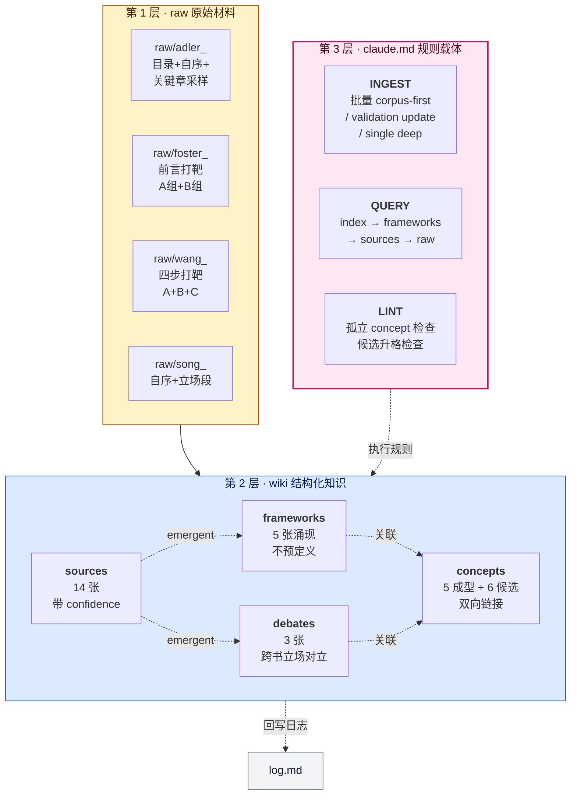
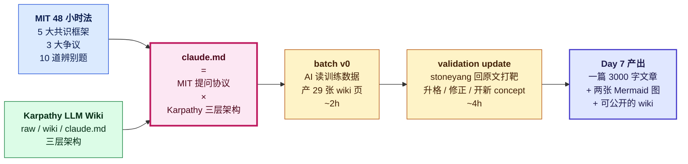

# Wiki 结构图

> 用途:展示 `claude.md` + Karpathy LLM Wiki 三层架构的**工程化骨架**
> 派生自:`Claude.md` 项目规则 v1 + `wiki/index.md`
> 派生日期:2026-04-15(Day 6)

---

## 主图:Karpathy 三层 × MIT 提问协议

---

## 补充图:合体公式的数据流

---

## 使用建议

- **公众号 A 版的第二张配图**用"主图(Karpathy 三层)",讲 claude.md 规则载体那段时插入
- **小红书版不建议用 wiki 结构图**(技术感太重,读者滑动时会跳过)
- **视频号口播**的第 3-4 段讲 AI 流水线时,用"合体公式数据流"图做黑板演示效果
- 两张图可在知乎 / GitHub README 里并列使用
