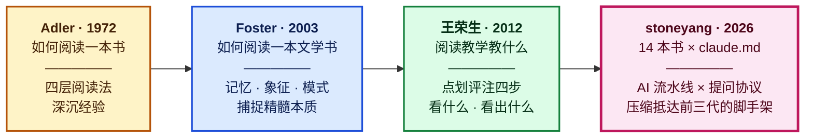
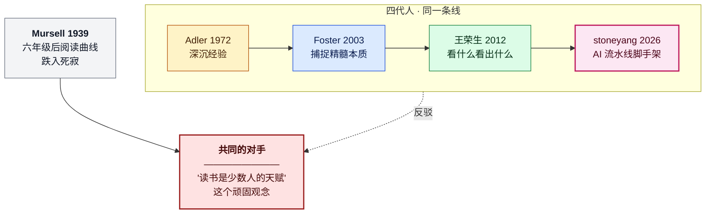

# 四代师承关系图

> 用途:公众号 A 版 + 小红书版 + 视频号口播的**核心视觉锚点**
> 派生自:`wiki/debates/01_文学是否需要结构化分析.md` v3 师承结构
> 派生日期:2026-04-15(Day 6)

---

## 主图(横向流程图)

---

## 补充图:共同的对手(带反对象)

---

## 使用建议

- **文章主图用"主图"**,单行横向结构最能凸显"接棒"感
- **补充图留给公众号 A 版**(有篇幅展开讨论 Mursell 叹息 + 三代共同对手时),或放在配图第二张
- **小红书版只用主图**,一屏一图,不要两张
- **视频号口播**把主图每一列单独做一张,4 张图顺序切换 + 配旁白
